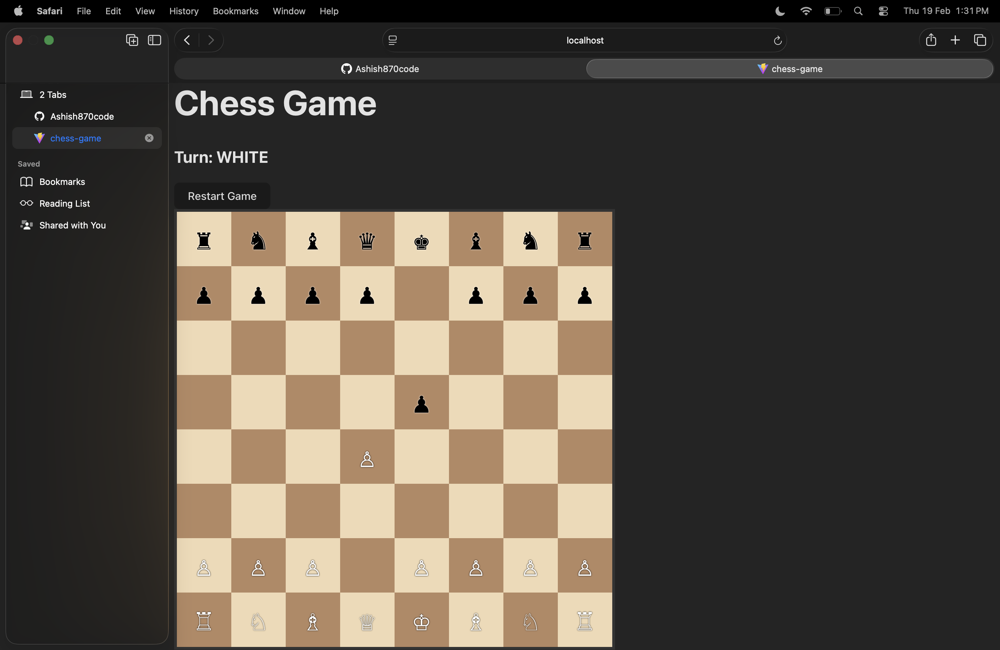
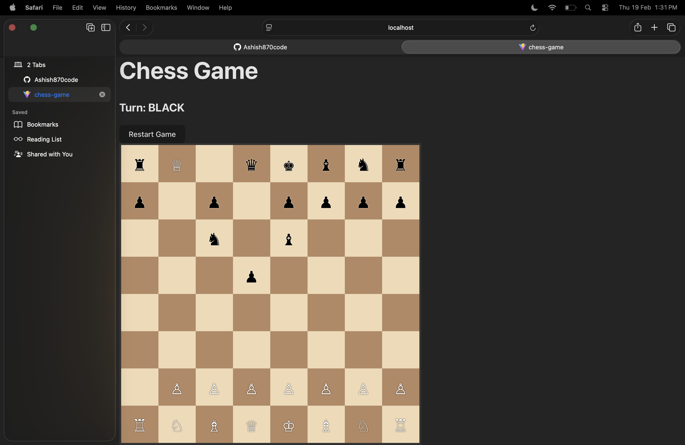
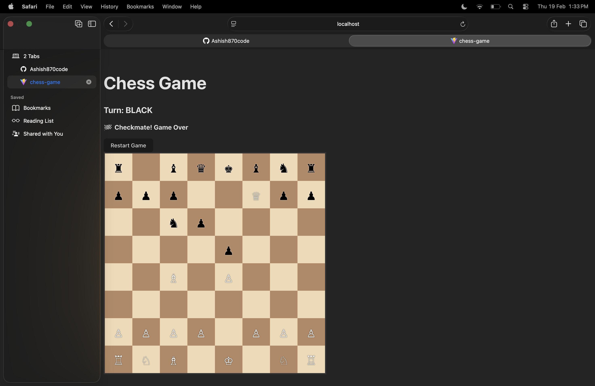

# React Chess Game ♟️


A fully playable **2-player local chess game** built with **React**.  
Supports all basic chess rules including valid moves, pawn promotion, check & checkmate detection.

---

## 🎯 Features

- Chessboard with **8x8 squares** and correctly oriented white (bottom) / black (top) pieces.  
- **All pieces move legally** according to chess rules.  
- **Pawn promotion** to queen when reaching last rank.  
- **Check and checkmate detection**.  
- **Highlight valid moves** when a piece is selected.  
- **Restart game button** to reset the board anytime.  
- Fully **responsive board and pieces** scaled appropriately.  

---

## 📸 Screenshots / GIFs

### Game Start


### Pawn Promotion


### Check / Checkmate


> You can replace these images with actual screenshots from your game.

---

## 🛠 Tech Stack

- **Frontend:** React, JavaScript, CSS  
- **No backend** (all logic handled on frontend)  

---

## 📂 File Structure
- **No backend** (all logic handled on frontend)  

---

## 📂 File Structure
- **No backend** (all logic handled on frontend)  

---

## 📂 File Structure
- **No backend** (all logic handled on frontend)  

---

## 📂 File Structure
- **No backend** (all logic handled on frontend)  

---

## 📂 File Structure
- **No backend** (all logic handled on frontend)  

---

## 📂 File Structure
- **No backend** (all logic handled on frontend)  

---

## 📂 File Structure
- **No backend** (all logic handled on frontend)  

---

## 📂 File Structure
- **No backend** (all logic handled on frontend)  

---

## 📂 File Structure

src/ ├── components/ │   └── ChessBoard.jsx ├── utils/ │   ├── initialBoard.js │   ├── moveLogic.js │   ├── piece.js │   └── checkLogic.js ├── App.jsx ├── App.css └── index.jsx

---

## 🚀 Setup & Run

1. Clone the repository:

```bash
git clone <your-repo-url>
cd <repo-folder>

2. Install Dependencies & Start Server

npm install
npm run dev

3. Open Your Browser
